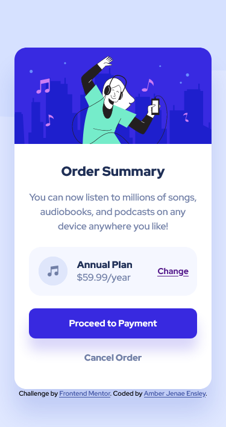

# Frontend Mentor - Order summary card solution

This is a solution to the [Order summary card challenge on Frontend Mentor](https://www.frontendmentor.io/challenges/order-summary-component-QlPmajDUj). Frontend Mentor seems like a great resource to brush up on a lot of my skills and build great projects. So here's my first one and I hope I keep improving from here!

## Table of contents

- [Overview](#overview)
  - [The challenge](#the-challenge)
  - [Screenshot](#screenshot)
  - [Links](#links)
- [My process](#my-process)
  - [Built with](#built-with)
  - [What I learned](#what-i-learned)
  - [Continued development](#continued-development)
- [Author](#author)

## Overview

### The challenge

Users should be able to:

- See hover states for interactive elements

### Screenshot

### Links

- Solution URL: [My Github Repo](https://github.com/amber-jenae-ensley/order-summary-component-fm)
- Live Site URL: [My Gitpages](https://amber-jenae-ensley.github.io/order-summary-component-fm/)

## My process

The first thing that I did was decide how I want the HTML organized. I try to use as many semantic elements as I can, and I thought about how I would nest elements so that I could turn them into flex or grid containers later. I also tried to make the css classnames as clear and understandable as I could (I didn't exactly use the BEM convention, but it's close).

Next, I created variables for all the colors I'd use based on the style guide, and I started targeting my classes and adding the proper css rules and properties. I used the Figma design file for anything I couldn't guestimate from what was provided (the Figma file was definitely a plus).

I used the mobile first design approach, where I matched my CSS rules based on what the mobile view is supposed to look like, so that later on I could add a media query for the desktop breakpoint. I also organized the heirarchy of my rules from least specific to most specific, so Universal, Elements, Classes, and IDs.

It took a lot of back and forth to make sure I was adding the right spacing for the flex container. This was done using mostly flex, and I used grid for the plan options section so that the music icon and plan details were lined up appropriately. 

Once I was satisfied with the mobile view, I moved onto the desktop view.

Finally, once I was satisfied with both, I did some proof reading, commenting, and cleaning up!

### Built with

- Semantic HTML5 markup
- CSS custom properties
- Flexbox
- CSS Grid
- Mobile-first workflow
- Media queries

### What I learned

Even though I feel pretty comfortable with Flexbox, I'm still not great with positioning (knowing when to use certain position properties when Flex or Grid isn't needed). I learned--or rather, relearned because I always forget--how to use auto margins to center items both horizontally and vertically. 

### Continued development

I'd like to continue working with responsive and mobile first designs. I also feel like I'm not consistent with what units I use, like rem vs. percentages, so I'd like to learn more about them and when's the best time to use which. 

## Author

- Frontend Mentor - [@ajensley](https://www.frontendmentor.io/profile/ajensley)
